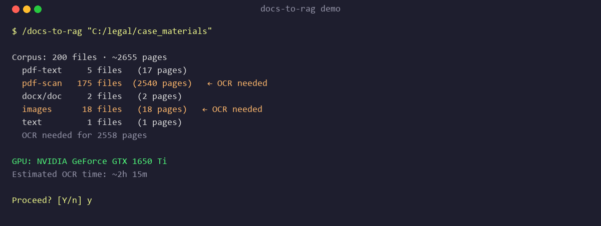
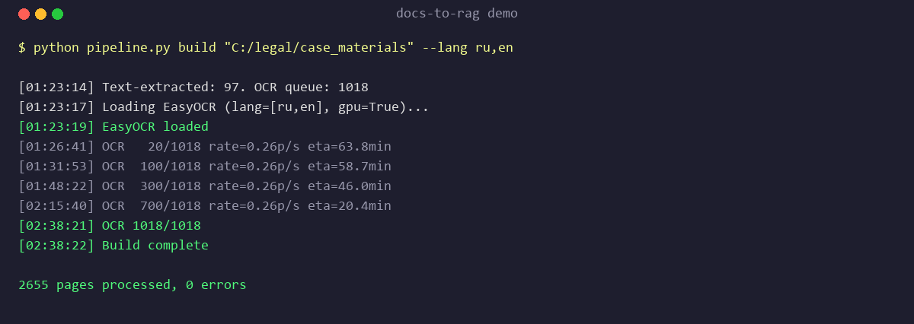
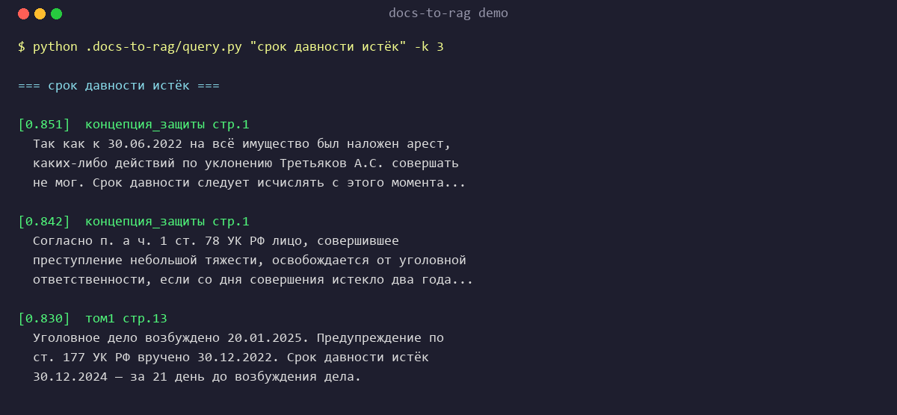

# docs-to-rag

> Turn any folder of documents into a local, searchable RAG database. Offline. GPU-accelerated. Zero cloud.

A Claude Code plugin that handles the messy part of document analysis: mixed PDFs (text + scans), DOCX, legacy DOC, images, and text — converts everything to clean text, runs OCR where needed, and builds a semantic search index you can query with one command.

Built for a real-world case: analysing a 2655-page Russian criminal case file in one day.





## What it does

Point it at a folder:

```
/docs-to-rag "C:/path/to/documents"
```

And get back:

```
documents/.docs-to-rag/
├── ocr/                 # one .txt per page
├── index/
│   ├── emb.npy          # (N, 384) float32 embeddings
│   └── meta.json        # chunk metadata
├── query.py             # python query.py "your question" -k 10
├── grep.py              # python grep.py "exact word"
└── README.md            # instructions for anyone using the output
```

Your original folder stays clean — everything lives in a hidden `.docs-to-rag/` subfolder.

## Why

Every serious document analysis starts with the same boring 3 hours: "I have a pile of PDFs and scans, some are OCR'd and some aren't, I need to search them all." This skill collapses that to one command.

Designed around three insights from building it:

1. **GPU OCR is 5-10x cheaper than cloud OCR** — for 2,655 pages, we burned 2h 15m of a GTX 1650 Ti instead of $50+ in Vision API calls.
2. **For <50k chunks, NumPy cosine beats HNSW** — simpler, no service to run, works everywhere.
3. **`multilingual-e5-small` is great enough for most languages** — 384-dim, 120 MB, runs on CPU.

## Install

### As a Claude Code plugin

```bash
git clone https://github.com/Stasensus/docs-to-rag ~/.claude/plugins/docs-to-rag
```

Then restart Claude Code. The `/docs-to-rag` skill becomes available.

### As a standalone Python script

```bash
git clone https://github.com/Stasensus/docs-to-rag
cd docs-to-rag
pip install pymupdf easyocr sentence-transformers numpy Pillow

python skills/docs-to-rag/pipeline.py detect "C:/my/folder"
python skills/docs-to-rag/pipeline.py build  "C:/my/folder"
python skills/docs-to-rag/pipeline.py index  "C:/my/folder"
python skills/docs-to-rag/pipeline.py query  "C:/my/folder" "my question"
```

## Dependencies

**Required:**
- Python 3.10+
- [PyMuPDF](https://github.com/pymupdf/PyMuPDF) — PDF rendering and text extraction
- [EasyOCR](https://github.com/JaidedAI/EasyOCR) — OCR for scans and images
- [sentence-transformers](https://github.com/UKPLab/sentence-transformers) — embeddings (default: `intfloat/multilingual-e5-small`)
- NumPy, Pillow

**Optional:**
- `torch` with CUDA for GPU-accelerated OCR (10x faster than CPU)
- `pywin32` on Windows for legacy `.doc` support (uses Word COM)
- `libreoffice` (`soffice` binary) on Linux/macOS for `.doc` support

`python pipeline.py check` verifies dependencies and prints a single `pip install` command for whatever is missing.

## Commands

| Command | What it does |
|---|---|
| `/docs-to-rag <path>` | Full pipeline (detect → convert → OCR → index) |
| `/docs-to-rag <path> --inspect` | Just detect — show file inventory, don't process |
| `/docs-to-rag <path> --no-ocr` | Skip OCR, only native-text PDFs / DOCX / TXT |
| `/docs-to-rag <path> --lang en,fr` | OCR languages (default: `ru,en`) |
| `/docs-to-rag <path> --dpi 300` | PDF render DPI for OCR (default 180) |
| `/docs-to-rag <path> --cpu` | Force CPU OCR even if GPU is available |
| `/docs-to-rag <path> --update` | Incremental — re-process only new/changed files |

All commands pass through to the underlying `pipeline.py`:

```bash
python pipeline.py check
python pipeline.py gpu-check
python pipeline.py detect <path>
python pipeline.py build   <path> [--lang ru,en] [--dpi 180] [--no-ocr] [--cpu]
python pipeline.py index   <path> [--model ...]
python pipeline.py query   <path> "question" [-k 10] [--full]
python pipeline.py grep    <path> "literal word" [-i]
```

## Supported inputs

| Format | How it's handled |
|---|---|
| PDF with text layer | `fitz.get_text()` directly — no OCR, instant |
| PDF scan | render to PNG (DPI configurable) → EasyOCR |
| DOCX | unzip + `word/document.xml` parse |
| DOC (legacy) | Word COM on Windows / `soffice` fallback on Linux/macOS |
| JPG/PNG/TIFF/BMP/WebP | EasyOCR directly |
| TXT/MD | copy, auto-detect encoding (UTF-8, UTF-16, CP1251, Latin-1) |

## Gotchas and how we handled them

### EasyOCR breaks on non-ASCII paths on Windows

`readtext("C:/папка/файл.png")` fails silently. Fix: load with PIL and pass an ndarray instead.

```python
img = np.array(Image.open(path).convert('RGB'))
reader.readtext(img, detail=0, paragraph=True)  # never pass the raw path
```

### ChromaDB 1.5.8 HNSW crashes on Windows

Intermittent "Error loading hnsw index" after successful insert. We use NumPy cosine instead — for ≤50k chunks, full scan on `(N, 384)` takes ~20 ms.

### PyTorch CPU vs CUDA

A plain `pip install torch` gets the CPU build. For GPU OCR:

```bash
pip uninstall -y torch torchvision
pip install torch==2.5.1 torchvision==0.20.1 --index-url https://download.pytorch.org/whl/cu121
```

Driver CUDA 12.x–13.x are all compatible with the cu121 wheel thanks to backward compat.

### Trust but verify PDF text layers

Some scanned PDFs have a "text layer" that's just page numbers. We require >200 chars across the first 5 pages before trusting it; otherwise we render and OCR.

### Legacy Word encoding

Word's "Save As text" on Russian locale produces CP1251. We try UTF-8, UTF-16, CP1251, Latin-1 in that order and normalize to UTF-8.

## Cost and scale

| Corpus size | Wall time (1 GPU) | Storage | Cost |
|---|---|---|---|
| 100 pages | ~2 min | ~5 MB | $0 |
| 1,000 pages | ~15 min | ~40 MB | $0 |
| 10,000 pages | ~2 h | ~400 MB | $0 |
| 50,000 pages | ~10 h | ~2 GB | $0 (overnight) |

Beyond ~50k chunks, swap the NumPy index for FAISS — the rest of the pipeline scales.

## The case that drove this

Built while processing a 2655-page criminal case file (mixed PDFs, scans, DOCX, images, legacy .doc) in Russian:

- **OCR:** 2655 pages in 2h 15m on GTX 1650 Ti
- **Index:** 6,169 chunks × 384 dim (~9.5 MB)
- **Queries:** 20 ms semantic lookup across the whole corpus
- **Deliverable:** handed off as a ZIP another lawyer could drop into their Claude Desktop

Full write-up of the case: _coming soon._

## What this skill does NOT do

- **No cloud uploads.** Private documents stay on your machine. If you want cloud OCR, use a different tool.
- **No knowledge graph.** For that, chain `/graphify` after `docs-to-rag` finishes.
- **No domain prompts.** This skill prepares the corpus; what you ask it is up to you.
- **No watch mode.** `--update` runs on demand.

## Honest limits

- OCR quality depends on source scan DPI. Handwritten / low-contrast scans: expect 70–90% accuracy. Add `--dpi 300` and accept 2× time.
- `multilingual-e5-small` covers ~100 languages but peaks on EN/RU/ZH/ES/FR/DE/JP. For rare languages try `--model intfloat/multilingual-e5-base`.
- Default chunk size is 1,200 chars. Good for prose. Tables and code can lose structure — `grep.py` remains the fallback.

## Contributing

Pull requests welcome. If you add support for a new file type, please:
1. Add a case to `detect` and `build` in `pipeline.py`
2. Document it in SKILL.md gotchas
3. Include a minimal test file in `tests/`

## License

MIT — see [LICENSE](LICENSE).

## Credits

- [EasyOCR](https://github.com/JaidedAI/EasyOCR) for the OCR heavy lifting
- [sentence-transformers](https://github.com/UKPLab/sentence-transformers) for the embeddings
- [PyMuPDF](https://github.com/pymupdf/PyMuPDF) for PDF handling
- Claude Code for orchestrating everything
